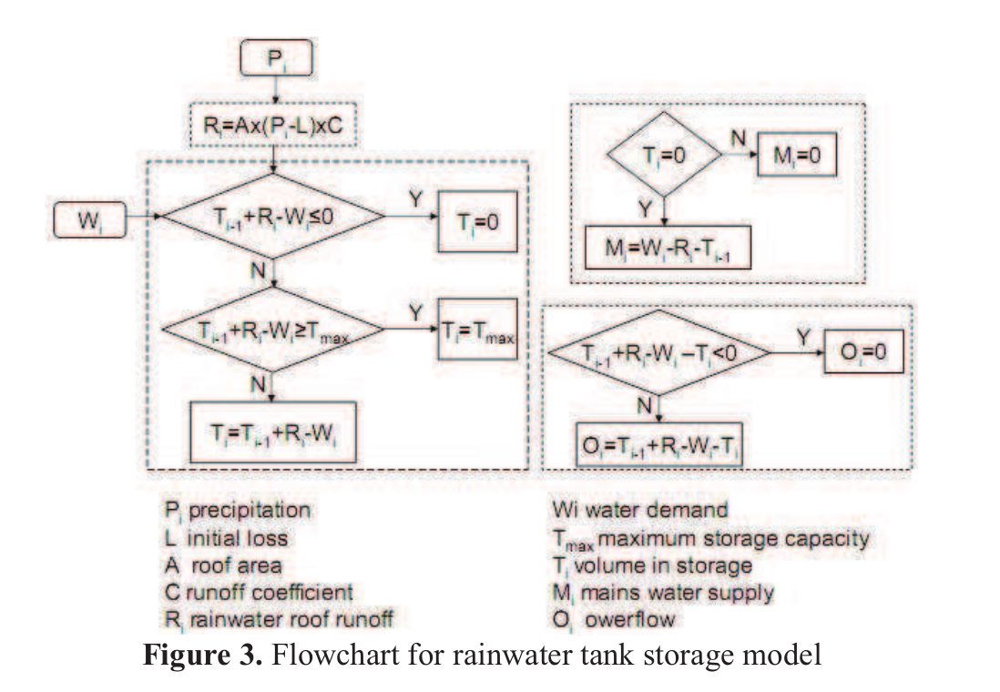
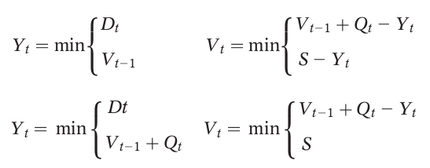

# Rain Water Harvesting Simulation

## Papers
* [A Model for Simulating Rainwater Harvesting Systems with Closed Tanks](https://www.ircwash.org/sites/default/files/213.2-95MO-14785.pdf)
* [A Simulation of Rainwater Harvesting Design and Demand-Side Controls for Large Hospitals](https://www.researchgate.net/publication/325292766_A_Simulation_of_Rainwater_Harvesting_Design_and_Demand-Side_Controls_for_Large_Hospitals)
* [Rainwater harvesting: model-based design evaluation](https://www.researchgate.net/publication/40895059_Rainwater_harvesting_Model-based_design_evaluation)
* [Simulation-based Spatial System for Rainwater Harvesting Systems In the Sustainable Campus Project](https://www.tandfonline.com/doi/pdf/10.3130/jaabe.11.213)
* [Modelling of a roof runoff harvesting system: The use of rainwater for toilet flushing](https://core.ac.uk/download/pdf/12042821.pdf)
* [Rainwater Harvesting System: An Approach for Optimum Tank Size Design and Assessment of Efficiency](https://cs-people.bu.edu/papon/pdfs/2017_STK_MTIP.pdf)
* [Development of a Computer Model for Domestic Rainwater Harvesting System](https://www.ijert.org/research/development-of-a-computer-model-for-domestic-rainwater-harvesting-system-IJERTV4IS090312.pdf)
* [Optimal sizing of rainwater harvesting systems for domestic water usages: A systematic literature review](https://www.sciencedirect.com/science/article/pii/S2590289X20300049)
* [A Novel Approach for Communal Rainwater Harvesting for Single-Family Housing: A study of Tank Size, Reliability, and Costs](https://vtechworks.lib.vt.edu/bitstream/handle/10919/97580/Semaan_M_D_2020.pdf?sequence=1&isAllowed=y)

## A Model for Simulating Rainwater Harvesting Systems with Closed Tanks

### Abstract
A model for simulating the performance of rainwater harvesting systems that uses covered water storage tanks is presented. The model explicitly takes into account the fluctuations in the annual rainfall. The importance of such simulation is that they can provide an essential information for evaluating the possible role of rainwater harvesting in meeting the water needs of rural communities lying in arid and semi-arid regions.

### Research Questions
* For a given demand of water what should be the size of rainwater
harvesting system which can meet this demand, with the desired degree of
reliability? (pg. 5)
* To what extent, and with what
degree of reliability, can a given system meet a fixed demand? (pg. 5)

**Key Point:** We would like to answer these questions *before building* a
rainwater harvesting system because it's the answers to these questions that will determine the advisability of building such systems in the first place.

Often such estimates are made on the basis of some simple characteristics of the rainfall data, like its mean, but such characterizations are inadequate when the rainfall shows a *large degree of annual fluctuation*.

**Modeling & Simulation Approach**: Monte-Carlo Simulation

## A Novel Approach for Communal Rainwater Harvesting for Single-Family Housing: A study of Tank Size, Reliability, and Costs

### Abstract
A novel approach to communal RWH for single-family houses. Instead of the traditional communal approach to RWH which uses only one storage location, we propose connecting multiple single-family homes' RWHSs to a communal backup tank, i.e., capturing overflow from multiple RWHS, which will increase reliability and water demand met in a way that will significantly improve the current performance of communal RWH. The proposed system will potentially maximize the availability of potable water while limiting spillage and overflow.

### Research Questions
1. What sizing model can describe the new communal rainwater harvesting system? (pg. 20)
2. How will this proposed storage by the new sizing model affect reliability of the system compared to the reliability of the original setup, and what is the optimal number of connected systems? (pg. 20)
3. What is the total cost of ownership associated with this new communal system of connecting multiple RWHS to a communal backup tank? (pg. 20)

### Interesting Notes
* **Tanks are the costliest individual component of the system** since they account for 30% of the whole-of-life costs (Gurung et al. 2012) (pg. 45)
* Simulations have shown that installed tanks can be oversized with respect to demand (Ward et al. 2010), and thus to optimize lifecycle costs, care should be taken to correctly size the system to **[(1)]** **decrease the cost** associated with an oversized
tank and **[(2)]** to **avoid increasing water age** (Wales 2006) (pg. 45)

> Elevated nutrient loadings, particularly of phosphorus, can result in **eutrophication** of
  an open storage in which cyanobacteria (also called blue-green algae) can bloom and
  *anaerobic conditions develop* (Wales 2006) (pg. 44).

[Eutrophication](https://en.wikipedia.org/wiki/Eutrophication) is when a body of water becomes overly enriched with minerals and nutrients which induce excessive growth of algae (Wikipedia).

> **The risk of eutrophication is higher if the water is stored for
  long periods** *and nutrients are not removed or reduced by the treatment process* (pg. 44). 

> Anaerobic conditions can develop in all storages, especially where elevated loads of
organic matter occur with inadequate aeration. This is because the bacteria that break
down organic matter consume the available dissolved oxygen faster than it can be
replenished from the atmosphere. This may be a greater problem in underground tanks
than in open storages. Management options include reducing the loads of organic matter
before storage by installing a gross pollutant trap and not operating the scheme during
periods of limited demand and long retention times (e.g. winter). (Wales 2006) (pg 45)

* Different types of models to simplify the evaluation and design of RWHS with a specific focus on the task of
storage sizing include (pg. 45 - 46):
  * **Empirical relationship methods** - empirical relationships are used to describe the sizing of rainwater tanks. Parameters used typically
include **rainfall**, **water demand**, and **roof area**.
  * **Stochastic parametric and non-parametric methods** - which use stochastic techniques to simulate important parameters in tank design, for which data is missing or incomplete.
  * **Continuous mass balance simulation of the tank inflow and outflow** - mass balances typically represent the inflow, outflow, and losses of the tank in order to characterize the tank size. The models may use different time scales and algorithmic models (yield before spillage and yield after spillage) to estimate tank sizes.

> Anaerobic conditions can develop in all storages, especially where elevated loads of
organic matter occur with inadequate aeration. This is because the bacteria that break
down organic matter consume the available dissolved oxygen faster than it can be
replenished from the atmosphere. This may be a greater problem in underground tanks
than in open storages. Management options include reducing the loads of organic matter
before storage by installing a gross pollutant trap and not operating the scheme during
periods of limited demand and long retention times (e.g. winter). 

## Development of a Computer Model for Domestic Rainwater Harvesting System

### Abstract
Develop a computer model named RAINMOD capable of performing comprehensive analysis for rooftop rainwater
harvesting system.

**Modeling & Simulation Approach:** Model utilized the concept of two-state Markov chains and Gamma distribution for generating daily rainfall from historic daily, monthly and mean monthly rainfall data which was then utilized for sizing of storage tank and prediction of performance parameters.

## Modelling of a roof runoff harvesting system: The use of rainwater for toilet flushing

**Modeling & Simulation Approach:** Equation & flow-chart based.

## Rainwater harvesting: model-based design evaluation

**Abstract:** Designs of two different new-build rainwater harvesting systems, based on simple methods, are evaluated using three different design methods, including a continuous simulation modelling approach. ... A transition from the use of simple RWH system design methods based on single calculations to more sophisticated continuous simulation tools is necessary.

**Modeling & Simulation Approach:** Three methods are used within the design evaluation, two of which are based on the approach developed by Fewkes (1999), which built on an original concept devised by Jenkins et al. (1978). The core of this approach is a water mass balance in the form:

Vt = Vt - 1 + Qt - Dt

Subject to 0 <= Vt <= S

Where:

Vt - (Rain) Water in storage at end of time interval, t

Qt - Inflow during time interval, t

Dt - Demand during time interval, t

S - Storage capacity

From this the 'yield-after-spill' and 'yield-before-spill' (YBS) operating rules were developed (Fewkes & Butler 2000), which take the form (for YAS and YBS respectively):

where:

Yt - Yield from store during time interval, t

The YAS and YBS rules determine the position of supply, demand and overflow in the calculation of storage volume. Fewkes & Butler (2000) undertook extensive analysis of the YAS and YBS algorithms which led to the derivation of capacity-demand and catchment-rainfall ratios (called the demand fraction and storage fraction, respectively. From this research it was concluded that the YAS operating rule (with an hourly or daily rainfall time.

Method 1 is based on the YAS approach in the form of a continuous simulation which can utilise daily rainfall and demand time series.

## Data
Hourly precipitation was received from:
https://www.ncdc.noaa.gov/cdo-web/search

and saved in [2228731.csv](./2228731.csv).

|Field|Data|
|-----|----|
|Locations|CITY:US290021|
|Begin Date|2010-01-01 00:00|
|End Date|2013-12-23 23:59|
|Data Types|HPCP|
|Units|Metric|
|Custom Flag(s)|Station NameGeographic LocationInclude Data Flags|

The same data in **Standard** (instead of *Metric*) was saved in [2228739.csv](./2228739.csv) for convenience.

Documentation:
https://www1.ncdc.noaa.gov/pub/data/cdo/documentation/PRECIP_HLY_documentation.pdf

> HPCP: The amount of precipitation recorded at the station for the hour ending at the
time specified for DATE above given in hundredths of inches or tenths of millimeters
depending on user’s specification of standard or metric units. The values 99999 means
the data value is missing. Hours with no precipitation are not shown.

## Pre-Requisites
Install conda.

## Environment Setup
Create **r**ain **w**ater **h**arvesting **s**imulation, `rwhs`, conda environment:

    conda env create --file environment.yml

Create iPython kernel for conda environment:

    python -m ipykernel install --user --name=rwhs
  